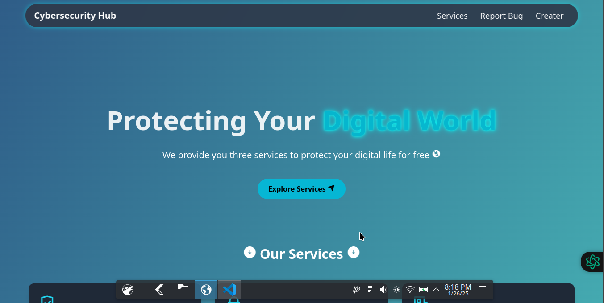
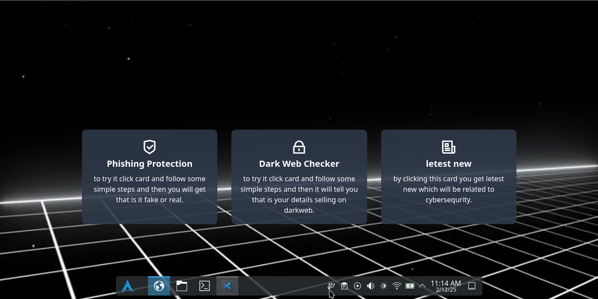
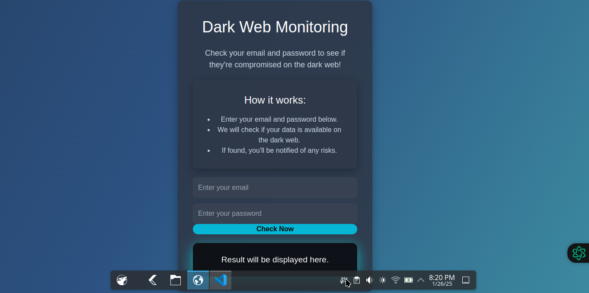

# Cybersecurity-Hub
Hay ! 💫 🚀 guys welcome to cybersequrity hub made with the help of HTML , CSS , JAVASCRIPT , TAILWIND CSS  AND OFCOUSE CHATGPT  (😎)

# 🌐 Welcome to Cybersecurity-Hub! 🚀
🎉 Experience the next level of cybersecurity tools and educational resources!

# 🔍 Features:

• Dark Web Monitoring 🕵️‍♂️: Scan for exposed credentials on the dark web.  
• Phishing Detector 🛡️: Identify and avoid malicious websites.  
• Latest Cyber News 📡: Stay updated with real-time news from trusted sources.  
• Bug Reporting 🐛: Help us improve by reporting issues easily.  

# 💡 Why this website?
This is more than just a prototype! 🌟 It’s a community-driven tool aiming to educate and protect users. Every bit of feedback you provide shapes its evolution!

# 📥 How to contribute?
Fork it, star it ⭐, and open a PR! Let's grow together!
0 commit comments

# 📷 Some screenshorts of website 🌠

# 📥 APIs USED

1. **Google Safe Browsing API**  
   - Used for Phishing Protection by checking URLs for threats.  
   - [Google Safe Browsing API Documentation](https://developers.google.com/safe-browsing)  

2. **Have I Been Pwned API**  
   - Used for Dark Web Monitoring to check if emails or passwords are compromised.  
   - [Have I Been Pwned API Documentation](https://haveibeenpwned.com/API/v3)  

3. **Google News API**  
   - Used to display the latest news on cybersecurity threats and updates.  
   - [Google News API Documentation](https://newsapi.org/)

# 🧐 IMPORTANT

Disclaimer: The information provided by this website is intended to enhance your cybersecurity awareness. While we strive for accuracy, we recommend double-checking critical details from trusted sources. Stay safe and informed!
